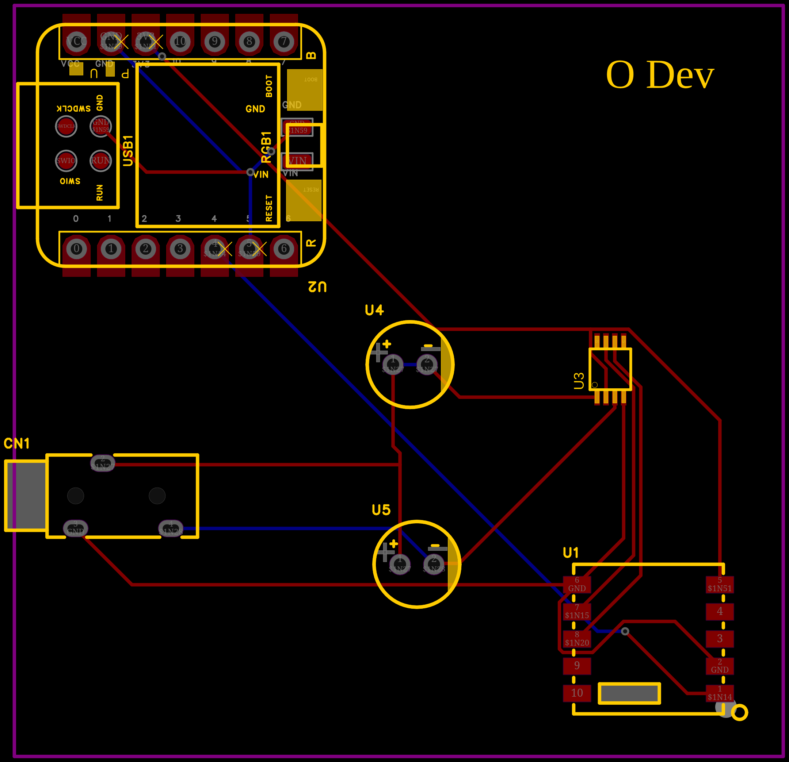
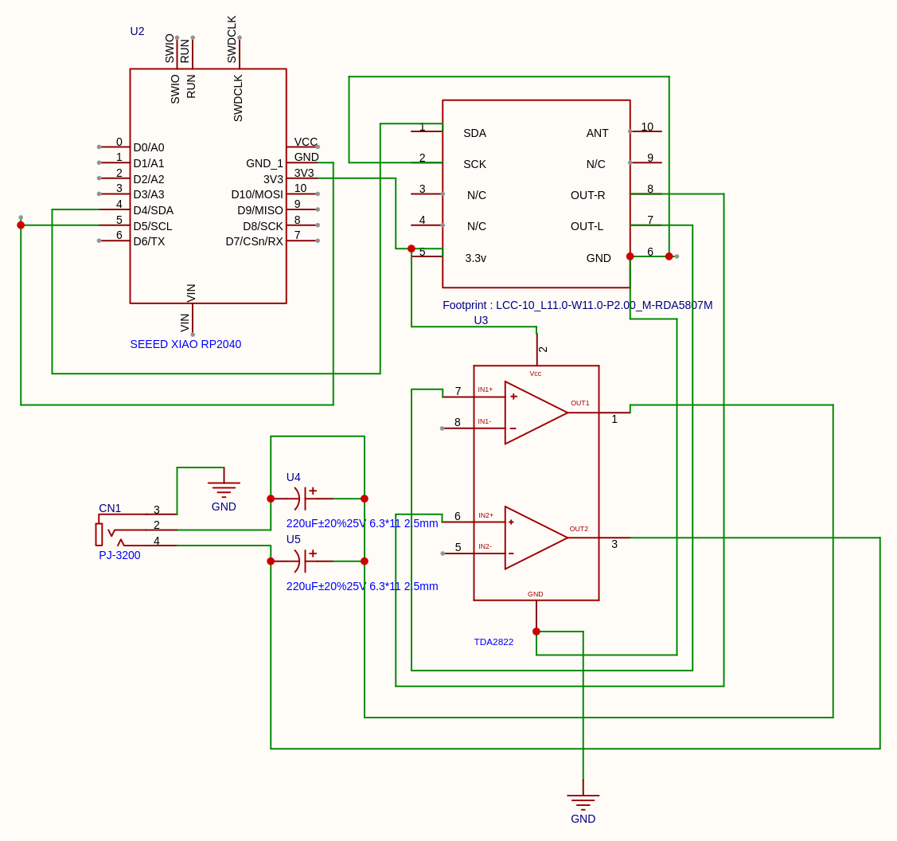
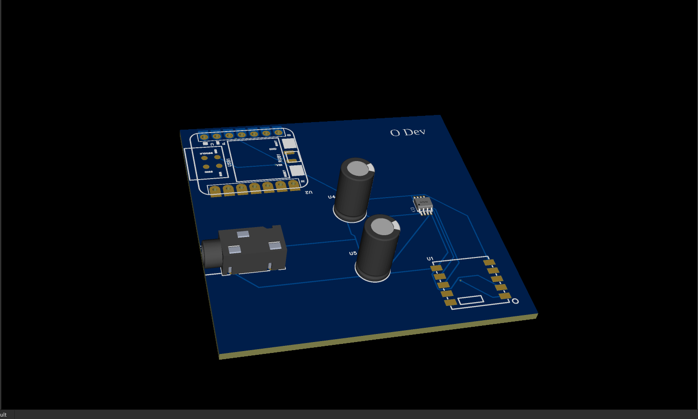

# Static Radio - Rádio FM Hack Club

[Preface] Estou construindo um rádio FM porque quero aprender como funciona como projetar uma PCB do zero e ganhar um kit pra montar ele. Escolhi o caminho do kit do Static para ter os componentes e seguir um guia mais direto.

## 07/09/2026 - Estudo e preparação

Hoje eu comecei o projeto pesquisando sobre o programa Static do Hack Club. Li a página inicial, os guias e a FAQ para entender o que é esperado: uma PCB, firmware e documentação pública. Depois li sobre o chip RDA5807, como ele funciona via I2C e como controlá-lo com o XIAO RP2040. Também estudei o TDA2822, que é o amplificador de áudio, e os outros componentes do kit.

Durante essa pesquisa, descobri que o RDA5807 se comunica por I2C no endereço 0x10, que o cristal de 32.768kHz é necessário para o sintetizador de frequência e que o chip suporta a faixa FM de 87.5 a 108.0 MHz. Também entendi como converter uma frequência em MHz para o valor de canal que o registrador do RDA5807 espera.

Documentos usados:
- RDA5807: https://github.com/pu2clr/RDA5807/blob/master/README.md 
- XIAO RP2040: https://wiki.seeedstudio.com/XIAO-RP2040/ Isso é a documentação tecnica mestre do microcontrolador do projeto. Ela detalha o mapeamento completo do chip RDA em formato reduzido, especificando que os pinos fisicos D4 e D% são pinos nativos para o barramento I2CO, operando estritamente em niveis logicos e seguros de 3.3v
- TDA2822: https://www.alldatasheet.com/datasheet-pdf/pdf/25055/STMICROELECTRONICS/TDA2822.html Manual do circuito interado amplificador de audio linear dual de baixa potencia. Fornece as cuvas de ganho interno, a faixa de tensao de alimentação flexivel e o esquema eletrico classico de aplicação para o desacoplamento de saidas em modo estereo, evitando oscilações de de alta frequencias nos alto-falantes de 8 Ohms.

### Time Spent: 6 horas

---

## 07/09/2026 - Esquemático e PCB

Hoje eu abri o EasyEDA e comecei o esquemático. Adicionei os componentes principais: XIAO RP2040, RDA5807M, TDA2822 e o jack de áudio 3.5mm. Conectei a alimentação 3.3V do XIAO para alimentar o chip de rádio RDA5807, e usei o pino de 5V (VBUS) do XIAO para alimentar o amplificador TDA2822, garantindo a potência necessária para o áudio. Interliguei todos os GNDs em um plano comum e fiz a conexão do barramento I2C entre o XIAO e o RDA5807 através dos pinos físicos D4 (SDA / GPIO6) e D5 (SCL / GPIO7). Depois, liguei as saídas de áudio do RDA5807 nas entradas do TDA2822 e a saída amplificada diretamente no jack de 3.5mm.

Depois converti o esquemático para PCB, posicionei os componentes e rodei o roteamento automático. Achei um problema no qual gastei bastante tempo: uma regra de roteamento mal configurada no EasyEDA que deixou trilhas muito próximas. Ajustei as regras de largura e espaçamento e o roteamento ficou correto. Por fim exportei os arquivos Gerber.

### Problemas encontrados
- O roteamento automático ficou com conflito de regras e precisei ajustar largura e espaçamento.
- Encontrei um FatalError na hora de montar a PCB, tive que passar cerca de 4 horas para tentar resolver, mas graças a Deus conseguir resolver e consegui montar :)
- O erro em si era esse: 
    - 2026-09-07 19:36:33[Warn] : Found some components Pins floating, suggest placing No Connect Flag on the Pins : U3.5,U3.8,U1.3,U1.4,U1.10,U1.9,U2.0,U2.1,U2.2,U2.3,U2.6,U2.VCC,U2.10,U2.9,U2.8,U2.7,U2.VIN,U2.SWDCLK,U2.RUN,U2.SWIO
    - 2026-09-07 19:36:33[Error] : The pin of the component SEEED XIAO RP2040 does not correspond to the pad (Pin has no corresponding pad : GND_2、GND_3): $1I4
- Tive que usar o Claude pra conseguir resolver, perguntei como resolver ele me ensinou a corrigir, mas ainda tive que ficar martelando pra resolver, depois de 2h fui conseguindo resolver aos poucos. Sabe o que estava causando isso? E porque o simbolo esquematico do componente "SEED XIAO RP2040" tinha tres pinos de terra no desenho: GND_1,GND_2, GND_3, mas o footprint associada só tinha um unico pad fisico chamado "GND". Como GN_2 e GND_3 não tinham nenhum pad correspondente na pegada real da placa, o EasyEDA acusava erro no DRC, pois não conseguia mapear esse pinos para nenhum ponto de solda fisico. Como resolvi: 
* 1 - Abrir o componente em modo de edição.
* 2 - Usado o Footprint Manager para conferir a lista de pinos do símbolo vs. lista de pads da footprint, confirmando que só existia um pad "GND" (e um pad "VCC", enquanto o pino estava nomeado "5V").
* 3 - Corrigido o pino "5V" → renomeado seu número para "VCC".
* 4 - Os pinos extras GND_2 e GND_3 foram selecionados e deletados diretamente do desenho do símbolo (não apenas renomeados, porque o EasyEDA não permite dois pinos com o mesmo número no mesmo componente).
* 5 - Mantido apenas GND_1, corretamente mapeado ao pad "GND" existente.
* 6 - Peça salva e propagada para todo o projeto.
* 7 - Rodado o Check DRC novamente... Finalmente, erro eliminado.

### Time Spent: 9 horas

---

## 08/09/2026 - Firmware

Hoje eu escrevi o firmware em C++ para o XIAO RP2040. Separei o código em arquivos diferentes para deixar mais organizado: `config.h` para constantes, `radio.h` para a interface da classe `Radio`, `radio.cpp` para a implementação do driver do RDA5807 e `main.cpp` como ponto de entrada. O rádio inicializa o chip via I2C, sintoniza uma frequência padrão e permite controlar o volume por software.

A ideia dessa estrutura é que, no futuro, eu possa adicionar controles físicos como botões e potenciômetros sem precisar reescrever o driver do RDA5807.

### Problemas encontrados
- Tive que tomar cuidado com o tipo `float` no PlatformIO/Arduino porque algumas versões do compilador podem causar warnings.
- O registrador de canal do RDA5807 usa 10 bits de frequência e 1 bit de tune; eu testei a conta `(freq - 76) * 10` até chegar no valor hexadecimal correto.

### Time Spent: 6 horas

## 08/09/2026 - Finalização
- Agora, pra finalizar escrevi o readme do projeto. Não sei se ficou do jeito que pediram, mas foi o que saiu da minha cabeça, falando a verdade, de la pra cá foi algo assustador, varios bugs aparecendo do nada kakakk, enfim, o importante é que eu ja terminei. Estou bastante ansioso kaka!

## Reflexão

### Por que eu o projetei dessa maneira?
Escolhi o XIAO RP2040 porque é pequeno, tem suporte a Arduino e é um dos componentes do kit do Static. Usei o RDA5807 porque ele é um receptor FM completo com saída de áudio estéreo e controle por I2C, o que simplifica muito o projeto. O TDA2822 foi escolhido porque é um amplificador simples de baixa potência, suficiente para fone de ouvido.

### Como é que eu o construí?
Primeiro estudei o datasheet e exemplos do RDA5807. Depois montei o esquemático no EasyEDA, fiz a PCB com autorouter e ajustei as regras. Em seguida escrevi o firmware organizado em classes, começando pela configuração e depois o driver do rádio. Deu um trabalho imenso pra fazer ele funcionar, estava dando varios erros, tive que passar 4 horas sentdo tentando resovler isso, quando terminei fui me deitar (ainda deu tempo de fazer um bolinho ksk);

### O que aconteceu quando o testei?
Ainda não testei o circuito fisicamente, pois estou esperando o kit chegar. O código foi estruturado para que, quando os componentes chegarem, eu possa compilar e testar rapidamente.
